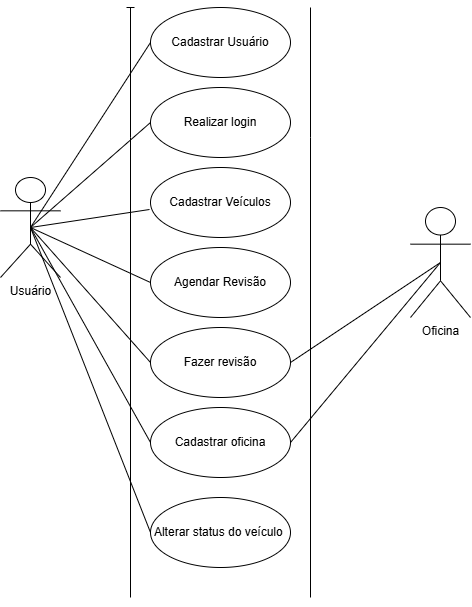
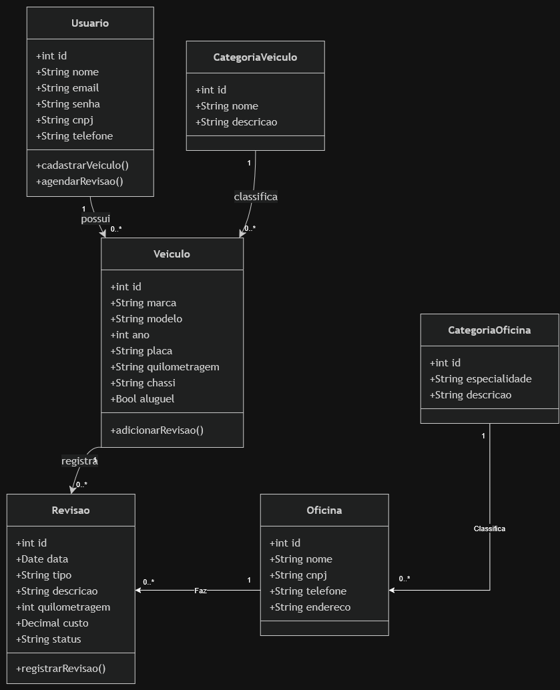

# Projeto **"Cartrix"**

**Autores:**

[Arthur Cabral](https://github.com/Abcabral) e [Gabriel Campanhã](https://github.com/GabrielCampas)

# Sumário:

- [Objetivo](#objetivo)
- [Metodologias](#metodologias)
- [Requisitos](#requisitos-do-projeto)
  - [Requisitos Funcionais](#requisitos-funcionais)
  - [Requisitos Não-Funcionais](#requisitos-nao-funcionais)
- [Estudo de Viabilidade](#estudo-de-viabilidade-do-projeto)
  - [Viabilidade Técnica](#1-viabilidade-técnica)
  - [Viabilidade Financeira](#2-viabilidade-financeira)
  - [Viabilidade Operacional](#3-viabilidade-operacional)
  - [Viabilidade de Mercado](#4-viabilidade-de-mercado)
- [Regras de Negócio](#regras-de-negócio)
- [Diagramas UML](#diagramas-uml)
  - [Diagrama de Casos de Uso](#-diagrama-de-casos-de-uso)
  - [Diagrama de Classes](#-diagrama-de-classes)
- [Design](#design-do-projeto)
  - [Paleta de Cores](#-paleta-de-cores)
  - [Wireframes](#-wireframes)
  - [Tipografia](#-tipografia)
  - [Protótipo](#-protótipo-do-projeto)
- [Referências e Fontes](#referências-e-fontes-utilizadas)

# **Objetivo**

# **Metodologias**

[Voltar ao sumário.](#sumário)

# **Requisitos do Projeto.**
## Requisitos Funcionais

### RF01 – Realizar cadastros
O sistema deve permitir que os usuários realizem o cadastro de **Veículos**.

- Marca
- Modelo
- Placa
- Chassi
- Quilometragem
- Status
- Danos

### RF02 – Realizar logins
O sistema deve permitir guardar informações dos usuários e utilizá-las para realizar o login dos mesmos.

- CNPJ
- Senha
- Email

### RF03 – Visualizar veículos
A página inicial deve exibir ao usuário a **lista de veículos** na frota da empresa e seus respectivos status.

### RF04 – Registrar revisões
O sistema deve permitir que os usuários registrem **revisões dos veículos**.

- Data da revisão
- Quilometragem
- Tipo de revisão
- Descrição
- Peças substituídas
- Valor
- Responsável

### RF05 – Consultar histórico de revisões
O sistema deve permitir que os usuários consultem o **histórico de revisões de cada veículo**.

- Data
- Tipo de revisão
- Quilometragem
- Descrição
- Responsável

### RF06 – Atualizar dados dos veículos
O sistema deve permitir que os usuários autorizados **alterem os dados cadastrados dos veículos**.

- Modelo
- Placa
- Quilometragem
- Status
- Danos

### RF07 – Registrar danos
O sistema deve permitir que os usuários registrem **danos identificados nos veículos**.

- Descrição do dano
- Data
- Gravidade
- Localização do dano
- Observações

### RF08 – Atualizar status dos veículos
O sistema deve permitir que os usuários **alterem o status dos veículos**.

- Disponível
- Em revisão
- Danificado
- Em manutenção
- Indisponível

### RF11 – Pesquisar veículos
O sistema deve permitir que os usuários **pesquisem veículos cadastrados**.

- Placa
- Marca
- Modelo
- Status
- Chassi

### RF12 – Filtrar veículos por status
O sistema deve permitir que os usuários **filtrem a lista de veículos** de acordo com seu status.

- Disponível
- Em revisão
- Danificado
- Em manutenção
- Indisponível

## Requisitos Nao Funcionais

### RNF01 – Desempenho
O sistema deve apresentar as páginas e informações solicitadas pelos usuários em um **tempo adequado**, evitando atrasos durante consultas, cadastros e atualizações.

### RNF02 – Disponibilidade
O sistema deve permanecer **disponível durante o horário de funcionamento da empresa**, permitindo o acesso às funcionalidades de gerenciamento da frota.

### RNF03 – Usabilidade
O sistema deve possuir uma **interface simples e intuitiva**, permitindo que os usuários realizem cadastros, consultas e registros de revisões sem dificuldades.

### RNF04 – Compatibilidade
O sistema deve ser compatível com os **principais navegadores web**.

- Google Chrome
- Mozilla Firefox
- Microsoft Edge

### RNF05 – Responsividade
O sistema deve possuir uma **interface responsiva**, adaptando-se adequadamente a diferentes tamanhos de tela.

- Computadores
- Tablets
- Celulares

### RNF06 – Integridade dos dados
O sistema deve garantir a **integridade e consistência das informações** cadastradas, evitando:

- Registros incompletos
- Registros duplicados
- Informações inconsistentes

### RNF07 – Manutenibilidade
O sistema deve possuir uma **estrutura organizada e modular**, facilitando a realização de:

- Correções
- Atualizações
- Futuras implementaçõess.

[Voltar ao sumário.](#sumário)

# Estudo de Viabilidade do Projeto.

## 1. Viabilidade Técnica.

Projeto viável, com tecnologias gratuitas open source que suprem todas as necessidades.

## 2. Viabilidade Financeira.

Projeto viável, com médio ou pouco investimento.

## 3. Viabilidade Operacional.

Projeto viável, que visa melhorar o controle interno de empresas relacionadas a veículos

## 4. Viabilidade de Mercado.

Projeto viável considerando seu uso por empresas menores, visto que as mais consolidadas ja possuem grande parte dessas funcionalidades em seus ERP

[Voltar ao sumário.](#sumário)

# **Regras de Negócio.**

## – Modelo de negócio Canvas

[Voltar ao sumário.](#sumário)

# **Diagramas UML.**

## – Diagrama de Casos de Uso

## – Diagrama de Classes

# **Design do Projeto.**

## – Paleta de cores:

|           | Nome                | Código HEX | Preview                                                                                                                                                                          |
| --------: | ------------------- | ---------- | -------------------------------------------------------------------------------------------------------------------------------------------------------------------------------- |
| **Cor 1** | Azul escuro         | #5e78ff    |  |
| **Cor 2** | Azul claro          | #1bb2f4    |  |
| **Cor 3** | Azul de confirmação | #0b5ed7    |  |
| **Cor 4** | Cinza claro         | #d4d4d4    |  |
| **Cor 5** | Cinza escuro        | #212121    |  |

## – Tipografia:

## – Protótipo do Projeto:

Protótipos disponíveis no [_Figma_](https://www.figma.com).

- Desktop: [Link]()
- Mobile: [Link]()

[Voltar ao sumário.](#sumário)

# **Referências e Fontes Utilizadas:**

- BRASIL. Lei Geral de Proteção de Dados (LGPD): Lei nº 13.709, de 14 de agosto de 2018.

- FIGMA. Disponível em <https://www.figma.com>.

- SEBRAE. Disponível em <https://canvas-apps.pr.sebrae.com.br>.

[Voltar ao sumário.](#sumário)

